## Plane Scape

## Sunucu Tarafında Kullanılan Teknolojiler


## İstemci Tarafında Kullanılan Teknolojiler


## Giriş


Uygulama geliştirilirken sunucu (server) tarafında Node.js, Express.js, MongoDB, Cors, ve Bcrypt.js gibi teknolojiler kullanıldı. Kullanıcı bilgileri ve uçuş rezervasyon bilgileri MongoDB'de saklanmaktadır. Kullanıcı şifreleri, güvenlik amacıyla Bcrypt.js kullanılarak şifrelenmiştir.

İstemci tarafı, JavaScript'in React kütüphanesi ile yazıldı. Uygulamanın durum (state) yönetimi için Redux-Toolkit kullanıldı ve kullanıcı (user) ile uçuş rezervasyon (bookFlight) bilgileri Redux-Persist ile localStorage'a kaydedildi. Uygulama içi yönlendirmeler (routing) için React Router DOM kullanıldı. Schiphol Havalimanı'nın sunduğu API'ler ve Express.js ile MongoDB kullanarak yazılan API'ler Axios ile çekildi.

Tasarımda Tailwind CSS kullanıldı. Uygulama içinde bildirim mesajları göstermek için React Hot Toast kütüphanesi kullanıldı. Veri çekme işlemleri sırasında, kullanıcıya bekleme durumunu göstermek için React Loader Spinner ile loading animasyonları oluşturuldu. İkon kullanımı için ise React Icons tercih edildi. Uygulama içinde tarih bilgileri moment kütüphanesi kullanarak formatlandı.

### Tanım

Bu uygulama, kullanıcıların uçak bileti rezervasyonu yapmalarını ve bilet satın almalarını sağlayan bir platformdur. Kullanıcılar, uçuşları tarih ve gidiş yönüne göre filtreleyebilir, uygun uçuşları kolayca bulabilirler. 

Bu uygulama geliştirilirken, uçuş bilgilerini içeren veriler, Schiphol Havalimanı'nın sunduğu https://developer.schiphol.nl/ sitesindeki API'ler aracılığıyla sağlandı. Bu API'ler, uçuş bilgilerini gerçek zamanlı olarak getirerek kullanıcıların güncel uçuşları görüntüleyebilmesini sağlamaktadır.


Kullanıcılar, bu uçuş bilgilerini kullanarak uçuş rezervasyonu yapabilmektedir. Yapılan rezervasyonlar, Node.js ve MongoDB kullanılarak veritabanında saklanmaktadır. Ayrıca, kullanıcılar API’ler aracılığıyla uçuş rezervasyonlarını görüntüleyebilir ve yönetebilirler. Bu sayede, mevcut rezervasyonlarına kolayca erişip, uçuş bilgilerini kontrol edebilirler.

### Proje Detayı

1. ### Hesap Oluşturma


| 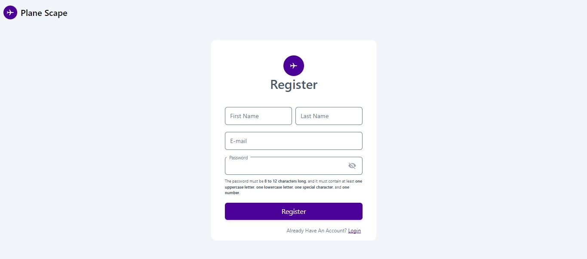 | 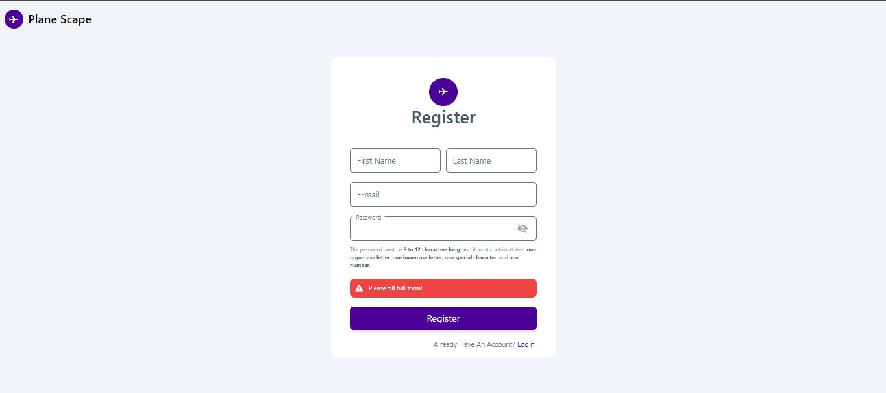 |
| -------------------------- | -------------------------- |

Kullanıcı burada sisteme kayıt olabilmekte.Kullanıcıdan isim, soyisim, email ve password bilgisi istenmektedir. Eğer herhangi bir eksik bilgi durumunda kullanıcıya ekranda hata mesajı gösterilmektedir.

2. ### Sisteme giriş yapma


| 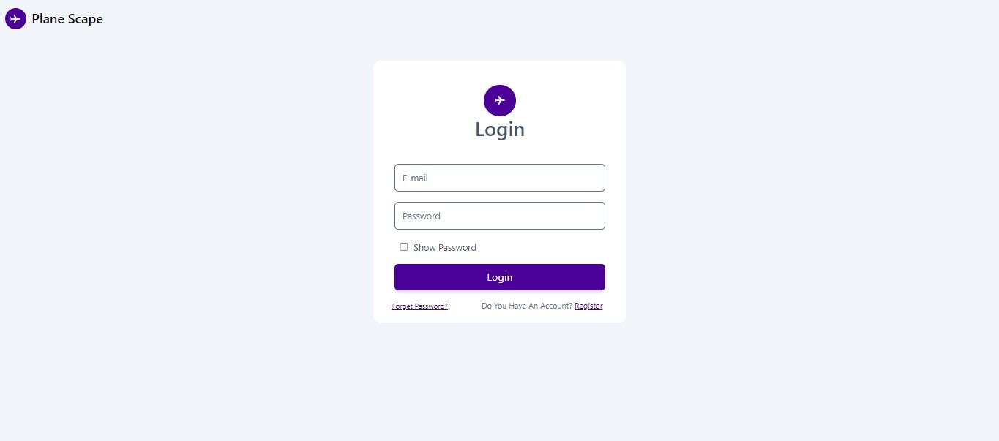 | 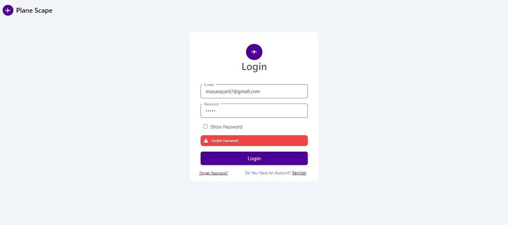 | 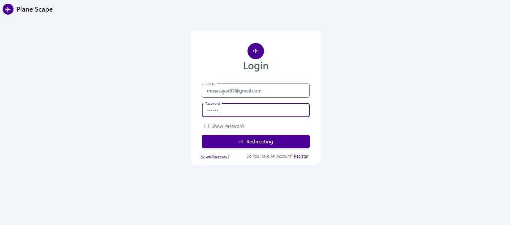|
| -------------------------- | -------------------------- |  -------------------------- | 

Kullanıcı `Register` sayfasında kayıt olduktan sonra `Login` sayfasına yönlendirilmektedir. Burada kullanıcıdan sisteme kayıt olurken girmiş olduğu `email` ve `password` bilgileri istenilmektedir. Kullanıcının `email` ve `password` bilgisi yanlış ise ekranda kullanıcıya hata mesajı gösterilmektedir. Kullanıcı doğru ``email`` ve ``password`` bilgisini girdikten sonra anasayfaya yönlendirilmektedir.

3. ### Anasayfa

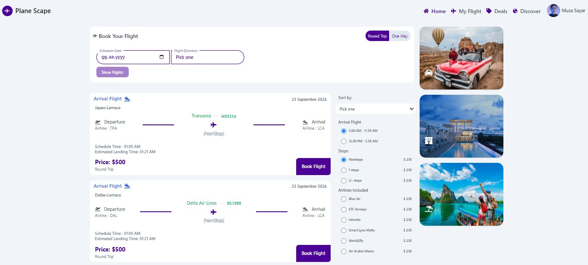

Kullanıcı başarılı bir şekilde sisteme giriş yaptıktan sonra Anasayfaya yönlendirilmekte. Bu sayfada bütün uçuş kayıtlarını görüntüleyebilmekte. Uçuşları tarih ve hareket yönüne göre filtreleyebilmekte. Ve uçuş rezervasyonu yapabilmektedir.

##### 3.a. Tarihe ve Hareket Yönüne göre uçuşları filtrleme


| 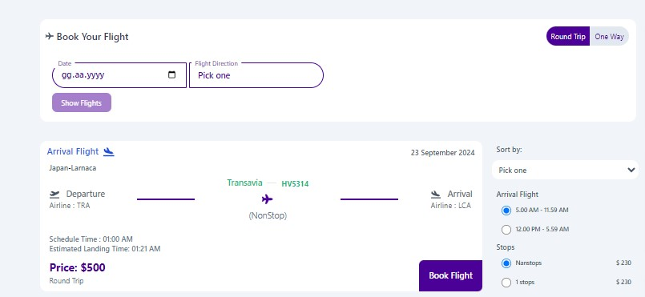 | 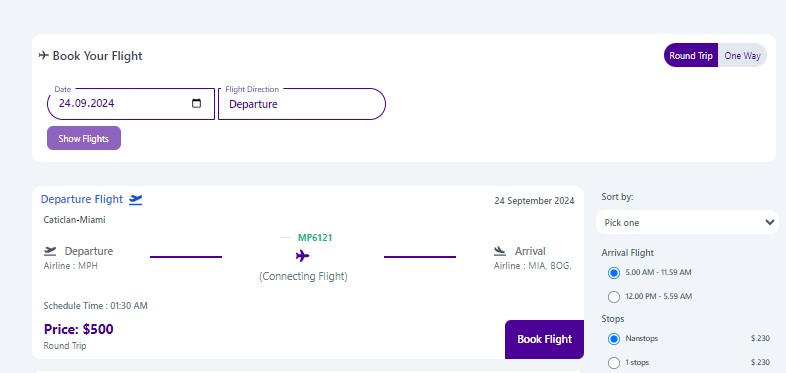 |
| -------------------------- | -------------------------- |

Bu alanda kullanıcı, sağlanan iki input alanı ile uçuşları filtreleyebilmektedir. Kullanıcı, öncelikle ``Tarih (Date)`` alanına filtrelemek istediği tarihi girer. Ardından, ``Uçuş Yönü (FlightDirection) ``alanında uçuş yönünü seçer. Bu alanda bir select menüsü açılır ve kullanıcı ``İniş (Arrival)`` veya ``Kalkış (Departure) `` seçeneklerinden birini belirleyebilir.  Eğer iki input alanı da boş ise ``Uçuşları Göster (Show Flights)`` butonu devre dışı ``(disabled)`` olur ve tıklanamaz. Ancak, her iki input alanı da dolu olduğunda buton aktif hale gelir ve uçuşlar istenilen kriterlere göre filtrelenir. 

Burada uçuşlar `24.09.2024` tarihine ve `Kalkış (Departure)` yöne göre filtrelenmiştir.

##### 3.b. Uçuş bilgleri

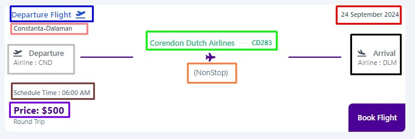

Burada listelen uçuş bilgisinin detayları yer almakta.
Yukarıdaki resimde belirtilen;

- `Mavi` renkteki alan içinde uçuş yönü gösterilmektedir. (Kalkış (Departure) - İniş (Arrival))

- `Kırmızı` renkteki alan içinde uçuşun olacağı tarih gösterilmektedir.

- `Pempe` renkteki alan içinde ise uçuşun hangi şehirler ve ülkeler arasında olduğu bilgisi gösterilmektedir.`` (Ör: Constanta-Dalaman (Bu uçuşun Romanyanın Dalaman şehrinden Türkiye'nin Muğla şehrine olduğunu gösteriyor))``


- `Gri` renkteki alan içinde uçuş yönü belirtilmektedir (Departure). Bu alanın altında ise havalimanının prefixICAO bilgisi yer almaktadır.

- `Yeşil` renkteki alanda uçuşun yapıldığı havayolu şirketinin adı ``(Corendon Dutch Airlines)`` ve ticariı uçuşun adı ``(CD283)`` yazmaktadır.

- `Kırmızı` alan içinde herhangi bir duraklama veya aktarma uçuşu durumu belirtilmiştir `Nonstop` uçuşun herhangi bir duraklama ve aktaram olmadan gerçkleşeceğini belirtir. `Connecting Flight` ise uçuşda duraklama ve aktarma olacağını belirtir. 

- `Siyah` renkteki alan içinde uçuş yönü belirtilmektedir (Arrival). Bu alanın altında ise uçuşun hangi havalimanına veya hangi havalimanların gideceği bilgisi yer almaktadır. Uçuşun rotasındaki havalimanlaro belirtilmektedir.

- `Kahverengi` alan içinde ise planlanan uçuşun saat bilgisi yer almaktadır. (Burada uçuşun yönü arrival olduğunda tahmini (estimatedLandingTime) gerçekleşecek olan iniş saati yer almakatadır)


*Not*: API'den çekilen uçuş saatleri, yerel saate göre formatlandığında, Türkiye'nin coğrafi konumundan dolayı saat farkı oluşabilmektedir.

- `Mor` renkteki alanda ise uçuşun fiyat bilgisi yer almaktadır.


- `Uçuş rezervasyonu ( Book Flight)` : kullanıcı `book flight` butonun tıklayarak uçuş rezervasyonu yapabilmektedir. Kullanıcı butona tıkladığın da ekranda bir bilgilendirme mesajı gözükmekte ve `/myFligh` sayfasın yönlendirilmekte. Kullanıcı bu sayfada rezervasyon yaptığı bütün uçuşları görebilmektedir.


| 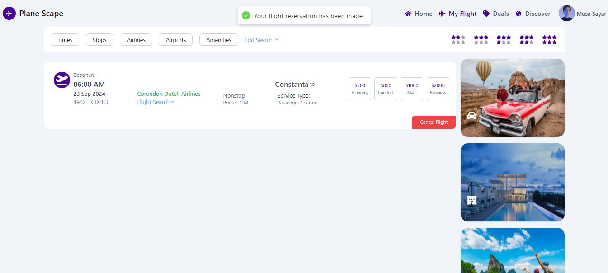 |  |
| -------------------------- | -------------------------- |

Daha sonra kullanıcı sayfaya gittikten sonra uçuş kayıtlarını görüntülediğinde daha önceden uçuş reservasyonu yaptığı bir daha aynı uçuş için tekrar reservasyon yapılmasına izin verilmiyor. `Book Flight` butonu içinde `reservation made` yazısı yer alıyor ve buton devre dışı `disabled` hale geliyor.

##### 3.c Uçuşları fiyata, varış saatine, havalimanın veya  aktarmalı ve aktarmasız olma durumuna göre fitrleme

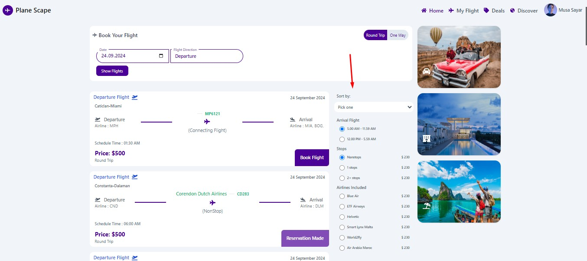

Buradaki alanda herhangi işlem gerçekleştirilememektedir. Tasarım için eklenmiştir.

### 4- Uçuşlarım Sayfası
Bu sayfada kullanıcı, rezervasyon yaptığı tüm uçuşların uçuş yönünü, uçuş tarihini, uçuş saatini, uçuşun servis tipini, uçuşun gerçekleştiği şehirler arasındaki bilgileri ve uçuşun fiyat durumlarını görüntüleyebilmektedir.

Kullanıcı, uçuş rezervasyonunu iptal etmek isterse, Clean Flight butonuna tıklaması yeterlidir.

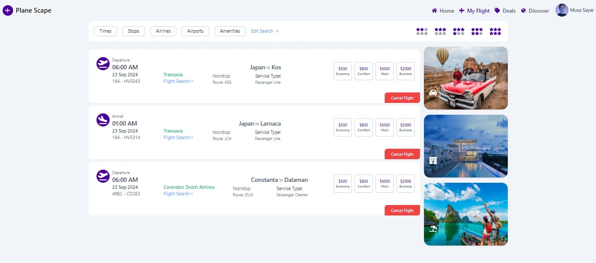


## Kurulun

1. Clone the repository:

```javasript
git clone https://github.com/musayar9/-Flight-Apps.git
```

2. Bağımlılıkları sunucya kurun; (Install dependencies server;)

```
npm install
```

or

```
yarn
```

3. Bağımlılıkları istemciye kurun  (Install dependencies client)

```
cd client
```

```
npm install
```

or

```
yarn
```

## Kullanım

Uygulamayı çalıştırmadan önce kök dizindeki .env dosyasına aşağıdaki bilgileri ekleyin:

### 1.a) Sunucu Taraf (Server Side)

```js

MONGO_URI = "<MONGO CLUSTER>"
PORT = ``
```

### 1.b ) Sunucu tarafı ayağı kaldırma ( Run the app sever)

```
npm run start
```

or

```
yarn start
```

### 2.a) İstemci Tarafı (Client Side)

```javascript
VITE_APP_ID = "<Your Schipol Api Id> "
VITE_APP_KEY = "<Your  Schipol Api Key>"
```

### 2.b) Uygulamayı istemci tarafında ayağı kaldırın - Run the app locally:

```
npm run start
```

or

```
yarn dev
```


### Geliştirici

- Geliştici - Musa Sayar

### İletişim

<p>
<a href="https://www.linkedin.com/in/musasayar/" target="blank"></a>
<a href="https://medium.com/@musasayar67" target="blank"></a>
</p>
